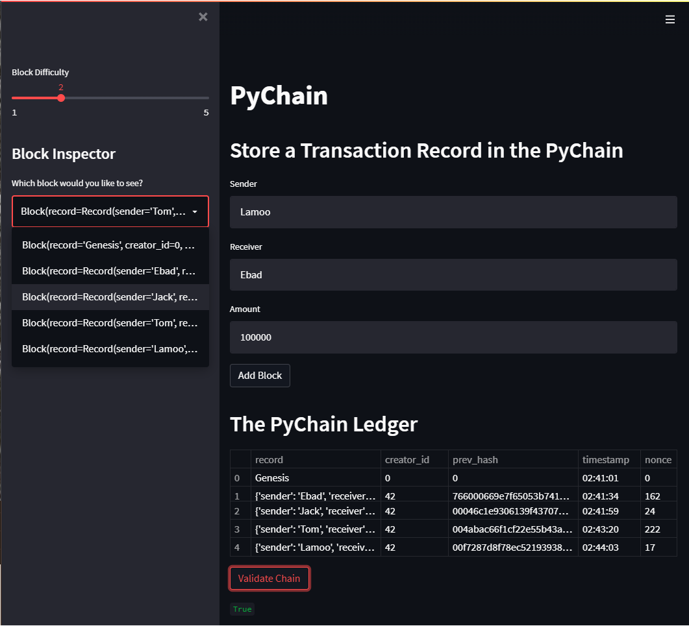

<h1 align="center">PyChain Blockchain Ledger</h1>
<h3 align="center">with Streamlit user interface and Block Explorer</h3>

  
    <section></section>
    <section> <b> By: Ebad Salehi </b> </section>

  

———————— ≡≡≡≡≡≡ ————————
 
<!-- TABLE OF CONTENTS -->

  
 <b>Table of Contents</b>

  <ul>
        <li><a href="#Glance"> At A Glance</a> </li>
        <li><a href="#Screenshots"> Screenshots</a></li>
        <li><a href="#Code">Source Code</a></li>
        <li><a href="#Tech">Libraries Used</a></li>
        <li><a href="#Author">Author</a></li>
  </ul>

———————— ≡≡≡≡≡≡ ————————

 

## At A Glance

This project is to build a blockchain-based ledger system using Python that provides a user-friendly webapp interface and Chain Explorer functions. This PyChain ledger records money transfer between senders and receivers in hashed block toensure and verify the integrity of the blockchain ledger.
 

## PyChain Streamlit Web Interface Screenshot

 

## Source Code

[pychain.py](pychain.py)
 

## Libraries Used

* streamlit
* dataclass
* typing
* datetime
* pandas
* hashlib

 

## Author
Ebad Salehi

(<a href="#top">Back to top</a>)

    
 
